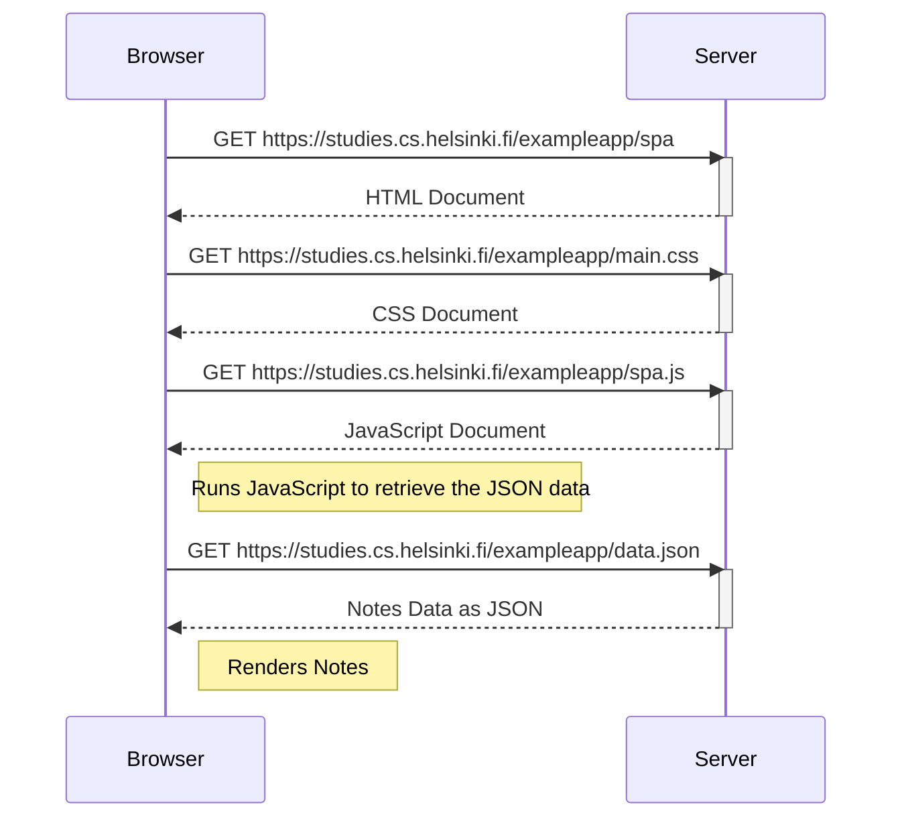
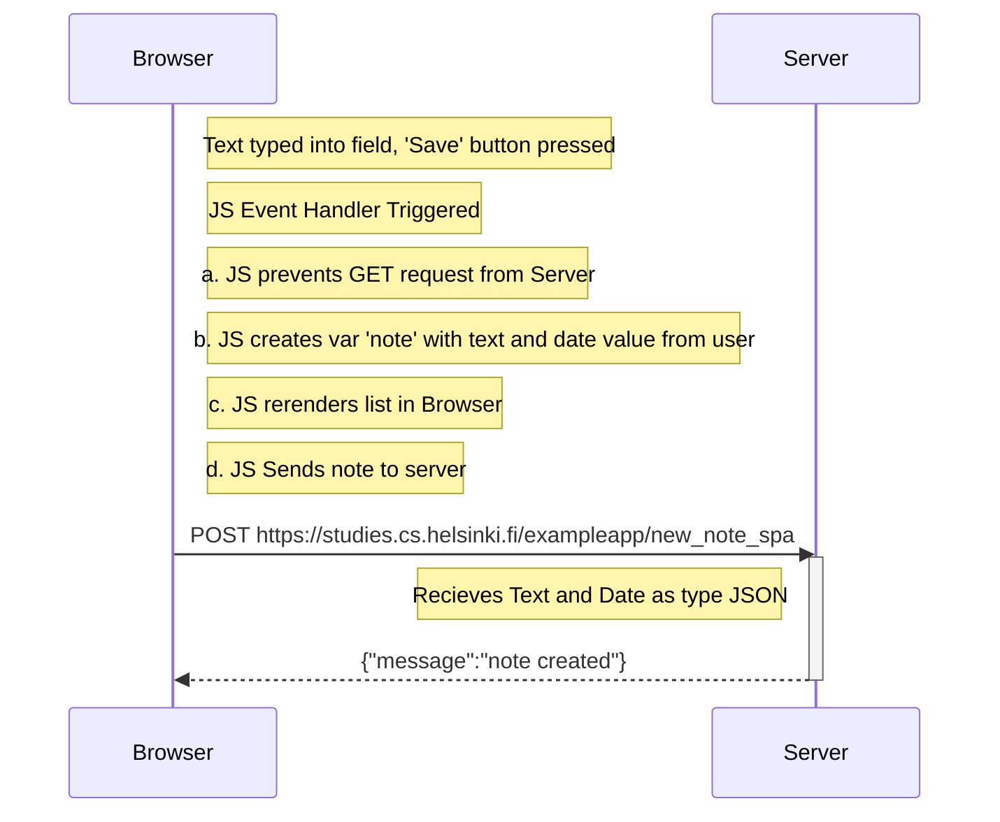

# FullStackOpen Part 0 Exercises

Submitted by Luke T-B

2026-03-02

### 0.1\: HTML

Review the basics of HTML by reading this tutorial from Mozilla: [HTML Tutorial](https://developer.mozilla.org/en-US/docs/Learn/Getting_started_with_the_web/HTML_basics)

> *This exercise is not submitted to GitHub, it's enough to just read the tutorial*

### 0.2\: CSS

Review the basics of CSS by reading thhis tutorial from Mozilla: [CSS Tutorial](https://developer.mozilla.org/en-US/docs/Learn/Getting_started_with_the_web/CSS_basics)

> *This exercise is not submitted to GitHub, it's enough to just read the tutorial*

### 0.3\: HTML Forms

Learn about the basics of HTML forms by reading Mozilla's tutorial: [Your First Form](https://developer.mozilla.org/en-US/docs/Learn/HTML/Forms/Your_first_HTML_form)

> *This exercise is not submitted to GitHub, it's enough to just read the tutorial*


### 0.4: New Note Diagram

In the section [Loading a page containing JavaScript - review](https://fullstackopen.com/en/part0/fundamentals_of_web_apps#loading-a-page-containing-java-script-review), the chain of events caused by opening the page [https://studies.cs.helsinki.fi/exampleapp/notes](https://studies.cs.helsinki.fi/exampleapp/notes) is depicted as a [sequence diagram](https://www.geeksforgeeks.org/unified-modeling-language-uml-sequence-diagrams/)

The diagram was made as a GitHub Markdown-file usiong the Mermaid -syntax as follows:

    sequenceDiagram
        participant browser
        participant server

        browser->>server: GET https://studies.cs.helsinki.fi/exampleapp/notes
        activate server
        server-->>browser: HTML document
        deactivate server

        browser->>server: GET https://studies.cs.helsinki.fi/exampleapp/main.css
        activate server
        server-->>browser: the css file
        deactivate server

        browser->>server: GET https://studies.cs.helsinki.fi/exampleapp/main.js
        activate server
        server-->>browser: the JavaScript file
        deactivate server

        Note right of browser: The browser starts executing the JavaScript code that fetches the JSON from the server

        browser->>server: GET https://studies.cs.helsinki.fi/exampleapp/data.json
        activate server
        server-->>browser: [{ "content": "HTML is easy", "date": "2023-1-1" }, ... ]
        deactivate server

        Note right of browser: The browser executes the callback function that renders the notes

Create a similar diagram depicting the situation where the user creates a new note on the page [https://studies.cs.helsinki.fi/exampleapp/notes](https://studies.cs.helsinki.fi/exampleapp/notes) by writing something into the text fiueld and clicking the Save Button. 

If necessary, show operations on the browser or on the server as comments on the diagram. 

The diagram does not have to be a sequence diagram. Any sensible way of presenting the events is fine. 

All necessary information for doing this, and the next two exercises, can be found ion the text of [this part](https://fullstackopen.com/en/part0/fundamentals_of_web_apps#forms-and-http-post). The idea of these exercises is to read the text once more and to think through what is going on there. Reading the application [code](https://github.com/mluukkai/example_app) is not necessary, but it is of course possible.

You can do the diagrams with any program, but perhaps the easiest and the best way to do diagrams is the [Mermaid](https://github.com/mermaid-js/mermaid#sequence-diagram-docs---live-editor) syntax that is now implemented in [GitHub](https://github.blog/2022-02-14-include-diagrams-markdown-files-mermaid/) Markdown pages!

> #### 0.4: Solution
>
 ```mermaid
    sequenceDiagram
        participant Browser
        participant Server
        
        Note right of Browser: Form Submit Event
        Browser->>Server: POST https://studies.cs.helsinki.fi/exampleapp/new_note
        activate Server
        Server-->>Browser: URL Redirect: 302 Found 
        deactivate Server

        Note right of Browser: Requests HTML Again
        Browser->>Server: GET https://studies.cs.helsinki.fi/exampleapp/notes
        activate Server
        Server-->>Browser: HTML Document
        deactivate Server

        Note right of Browser: Requests CSS
        Browser->>Server: GET https://studies.cs.helsinki.fi/exampleapp/main.css
        activate Server
        Server-->>Browser: CSS Document main.css
        deactivate Server

        Note right of Browser: Request JavaScript
        Browser->>Server: GET https://studies.cs.helsinki.fi/exampleapp/main.js
        activate Server
        Server-->>Browser: JavaScript maion.js
        deactivate Server

        Note right of Browser: Request Data
        Browser->>Server: GET https://studies.cs.helsinki.fi/exampleapp/data.json
        activate Server
        Server-->>Browser: RAW Data data.json
        deactivate Server
```

### 0.5: Single Page App Diagram

Create a diagram depicting the situation where the user goes to the [single-page app](https://fullstackopen.com/en/part0/fundamentals_of_web_apps#single-page-app) version of the the notes app at [https://studies.cs.helsinki.fi/exampleapp/spa](https://studies.cs.helsinki.fi/exampleapp/spa).

> #### 0.5: Solution



### 0.6: New Note in Single Page App Diagram

Create a diagram depicting the situation where user creates a new note using the single-page version of the app.

> #### 0.6: Solution


